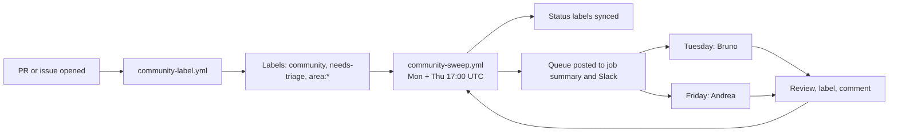
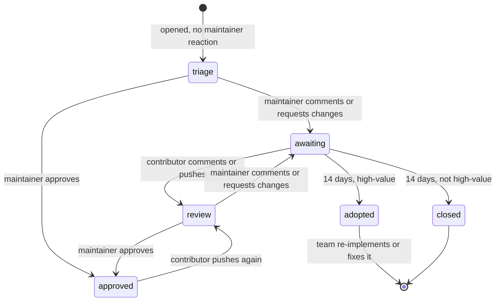

# Community triage

How we handle pull requests and issues from people outside the Kilo team.

The goal is simple. Maintainers see the community work that matters, and contributors know what happens next.

Background: [Slack discussion](https://anaconda.slack.com/archives/C0BJ2GQ40HM/p1791377022461359).

## Overview

Two workflows do the work. Both use `script/kilocode/community-triage.ts`.

| Workflow | Runs | Does |
|---|---|---|
| `community-label.yml` | When a PR or issue opens or is edited | Adds `community`, `needs-triage` (new items only, not reopened ones) and `area:*` labels |
| `community-sweep.yml` | Monday and Thursday, 17:00 UTC | Syncs status labels, closes stale PRs, posts the queue |

The sweep runs the evening before each maintainer slot. Andrea starts Friday and Bruno starts Tuesday with a fresh queue.

## Who is a maintainer

An author or commenter is a maintainer when one of these is true:

- GitHub shows them as `OWNER`, `MEMBER` or `COLLABORATOR`.
- Their login is in the repo variable `COMMUNITY_MAINTAINERS` (comma separated).
- The optional secret `COMMUNITY_TRIAGE_MEMBER_TOKEN` (`read:org`) shows they are in the org.

The default token cannot see private org members. They look like normal contributors. Set the variable or the secret so their PRs are not labeled `community`.

Bots are ignored.

## Labels

Set by the workflows:

| Label | Meaning |
|---|---|
| `community` | Author is not a maintainer |
| `area:vscode`, `area:cli`, `area:agent-manager`, `area:jetbrains`, `area:desktop`, `area:docs`, `area:gateway`, `area:sdk`, `area:ui`, `area:i18n` | Part of the repo. Comes from the title scope, the changed paths, or the issue "Component" dropdown |
| `needs-triage` | No maintainer has reacted yet |
| `needs-review` | The contributor replied or pushed. A maintainer should look again |
| `awaiting-contributor` | A maintainer reacted last. The 14 day clock runs |
| `ci-failing` | Checks on the last commit failed |
| `needs-reimplementation` | `high-value` PR with no reply for 14 days. The team takes it over |

Set by hand:

| Label | Meaning |
|---|---|
| `high-value` | We want this change. The sweep never closes it |
| `low-value` | Triaged. Not a priority |
| `keep-open` | The sweep never closes this PR |

The sweep owns the status labels. It adds and removes them on its own. Do not manage them by hand.

`area:*` labels are only added, never removed. Fix a wrong one by hand.

## Whose turn is it

The sweep reads the comments, reviews, review replies, commits and reopen events of each open community PR. Drafts are skipped. A reopen by the author counts as a reply. The sweep ignores commit dates more than 5 minutes in the future.

The sweep reads only the latest events. If it finds no maintainer reaction on a PR with more events than it can read, it labels the PR `needs-review` so a person decides.

| State | Label | Rule |
|---|---|---|
| triage | `needs-triage` | No maintainer reaction yet, and no `high-value` or `low-value` label |
| review | `needs-review` | The contributor acted after the last maintainer reaction, or a `high-value` or `low-value` label exists |
| approved | none | The last maintainer reaction is an approval |
| awaiting | `awaiting-contributor` | The last maintainer reaction asked for something and the contributor has not answered |

The 14 day clock starts at the time of the last maintainer reaction.

## The 14 day rule

When a PR has been `awaiting-contributor` for 14 days:

| PR | Result |
|---|---|
| Has `high-value` | Gets `needs-reimplementation` and shows in the digest under "Adopt". Add it to the standup doc and pick an owner |
| Has `keep-open` | Nothing happens |
| Anything else | Closed with a comment |

Before the sweep closes or adopts a PR, it checks the full history for a contributor reply. This catches replies on long PRs.

Closing is **off by default**. Until it is on, the sweep only logs what it would close. To turn it on, set the repo variable `COMMUNITY_AUTO_CLOSE_ENABLED` to `true`. To try it by hand, run the sweep from the Actions tab and tick "close".

When a PR first gets `awaiting-contributor`, the sweep also posts one comment that gives the due date. That comment is also off until closing is on. The sweep posts at most 20 comments per run (`MAX_COMMENTS`).

`kilo-auto-close.yml` is separate. It does not read these labels. It still closes any PR with no activity for 30 days, including `high-value` and `keep-open` PRs.

## The maintainer routine

Open the latest "Community sweep" run. The job summary has the queue. A copy goes to Slack when `COMMUNITY_TRIAGE_SLACK_WEBHOOK` is set.

1. **Adopt**: pick an owner and add the PR to the standup doc.
2. **Needs triage**: decide. Add `high-value` or `low-value`, or comment on it. Not sure? Put it in the standup doc.
3. **Needs review**: the contributor replied. Review again.
4. **Approved**: merge.
5. **Waiting for contributor**: nothing to do.

Friday and Tuesday are three to four days apart. This gives contributors time to reply between reviews.

Useful searches:

- All community PRs: `is:pr is:open label:community`
- Needs a maintainer: `is:pr is:open label:needs-triage,needs-review`
- One area: `is:pr is:open label:community label:area:vscode`

## Issues

New issues get the `community` label, `needs-triage` and an `area:*` label. The area comes from the required "Component" dropdown in the bug and feature templates. The answer "Other / not sure" adds no `area:*` label. The sweep only handles PRs.

## Setup

| Name | Kind | Needed | Purpose |
|---|---|---|---|
| `COMMUNITY_AUTO_CLOSE_ENABLED` | Variable | No | `true` turns on closing and comments |
| `COMMUNITY_MAINTAINERS` | Variable | No | Logins treated as maintainers |
| `COMMUNITY_TRIAGE_MEMBER_TOKEN` | Secret | No | Token with `read:org`. Finds private org members |
| `COMMUNITY_TRIAGE_SLACK_WEBHOOK` | Secret | No | Posts the queue to Slack |

Labels are created by the workflows. Run "Community sweep" once by hand after merge to create them and label the open PRs.

## Safety

- `community-label.yml` uses `pull_request_target`. It checks out the base branch only. It never runs PR code.
- The sweep never closes drafts, `high-value` PRs or `keep-open` PRs.
- Closed PRs can be reopened by the contributor.
